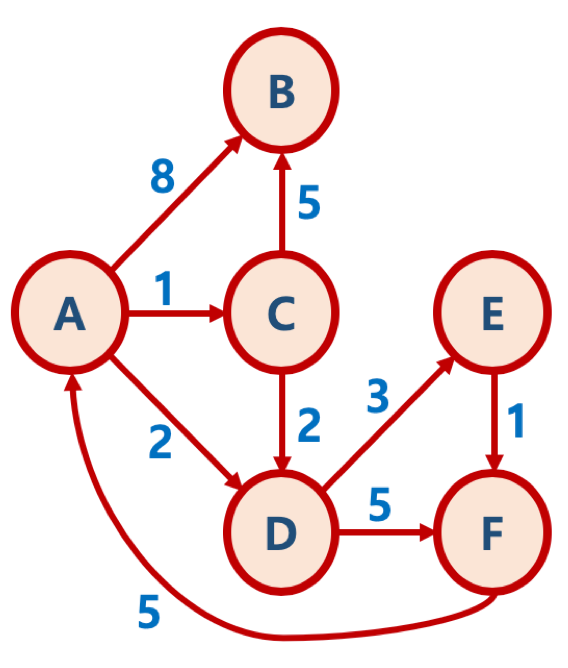

## 최단 경로 알고리즘의 이해
### 1. 최단 경로 문제란?
* 최단 경로 문제란 두 노드를 잇는 가장 짧은 경로를 찾는 문제
* 가중치 그래프 (Weighted Graph) 에서 간선 (Edge) 의 가중치의 합이 최소가 되도록 하는 경로 찾기가 목적


### 최단 경로 문제 종류
1. 단일 출발 (single-source) 최단 경로 문제
   * 그래프 내의 특정 노드 u에서 출발해서, 그래프 내의 모든 다른 노드에 도착하는 가장 짧은 경로를 찾는 문제
2. 단일 도착 (single-destination) 최단 경로 문제
   * 모든 노드에서 출발해서, 그래프 내의 특정노드 u로 도착하는 가장 짧은 경로를 찾는 문제
3. 단일 쌍 (single-pair) 최단 경로 문제
   * 주어진 노드 u와 v 간의 최단 경로를 찾는 문제
4. 전체 쌍 (all-pair) 최단 경로 
   * 그래프 내의 모든 노드 쌍 (u,v) 사이에 대한 최단 경로를 찾는 문제

### 2. 최단 경로 알고리즘 - 다익스트라 알고리즘 (Dijkstra Algorithm)
* "단일 출발 최단 경로 문제" 에 해당
  * 하나의 정점에서 다른 모든 정점까지의 가장 짧은 거리를 구하는 문제
* 방향이 있는 가중치 그래프
* 본인을 포함한 모든 노드들을 무한대로 놓고 계산하여 노드들의 가중치를 리스트에 넣는다



### 다익스트라 알고리즘 로직
- 첫 정점을 기준으로 연결되어 있는 정점들을 추가해 가며, 최단 거리를 갱신하는 기법
- 다익스트라 알고리즘은 너비우선탐색(BFS)와 유사
   - 첫 정점부터 각 노드간의 거리를 저장하는 배열을 만든 후, 첫 정점의 인접 노드 간의 거리부터 먼저 계산하면서, 첫 정점부터 해당 노드간의 가장 짧은 거리를 해당 배열에 업데이트
>  다익스트라 알고리즘의 다양한 변형 로직이 있지만, 가장 개선된 우선순위 큐를 사용하는 방식에 집중해서 설명하기로 함

- 우선순위 큐를 활용한 다익스트라 알고리즘
   - 우선순위 큐는 MinHeap 방식을 활용해서, 현재 가장 짧은 거리를 가진 노드 정보를 먼저 꺼내게 됨

   1) 첫 정점을 기준으로 배열을 선언하여 첫 정점에서 각 정점까지의 거리를 저장
      - 초기에는 첫 정점의 거리는 0, 나머지는 무한대로 저장함 (inf 라고 표현함)
      - 우선순위 큐에 (첫 정점, 거리 0) 만 먼저 넣음

   2) 우선순위 큐에서 노드를 꺼냄
      - 처음에는 첫 정점만 저장되어 있으므로, 첫 정점이 꺼내짐
      - 첫 정점에 인접한 노드들 각각에 대해, 첫 정점에서 각 노드로 가는 거리와 현재 배열에 저장되어 있는 첫 정점에서 각 정점까지의 거리를 비교한다.
      - 배열에 저장되어 있는 거리보다, 첫 정점에서 해당 노드로 가는 거리가 더 짧을 경우, 배열에 해당 노드의 거리를 업데이트한다.
      - 배열에 해당 노드의 거리가 업데이트된 경우, 우선순위 큐에 넣는다.
         - 결과적으로 너비 우선 탐색 방식과 유사하게, 첫 정점에 인접한 노드들을 순차적으로 방문하게 됨
         - 만약 배열에 기록된 현재까지 발견된 가장 짧은 거리보다, 더 긴 거리(루트)를 가진 (노드, 거리)의 경우에는 해당 노드와 인접한 노드간의 거리 계산을 하지 않음

   3) 2번의 과정을 우선순위 큐에 꺼낼 노드가 없을 때까지 반복한다.

### 3. 다익스트라 알고리즘 예제 
1. 우선 순위 Queue 활용

### 4. 구현을 위한 JAVA 문법
1. 비교를 위해 Comparable을 implements한 **"Edge"** 객체 생성
```java
import java.util.*;
public class Edge implements Comparable<Edge>{
    public int distance;
    public String vertex;
    public Edge(int distance, String vertex){
        this.distance = distance;
        this.vertex = vertex;
    }
    public String toString(){
        return "Vertex : " + this.vertex + ", Distance : " + this.distance;
    }

    @Override
    public int compareTo(Edge edge) {
        return this.distance - edge.distance;
    }
}
```
